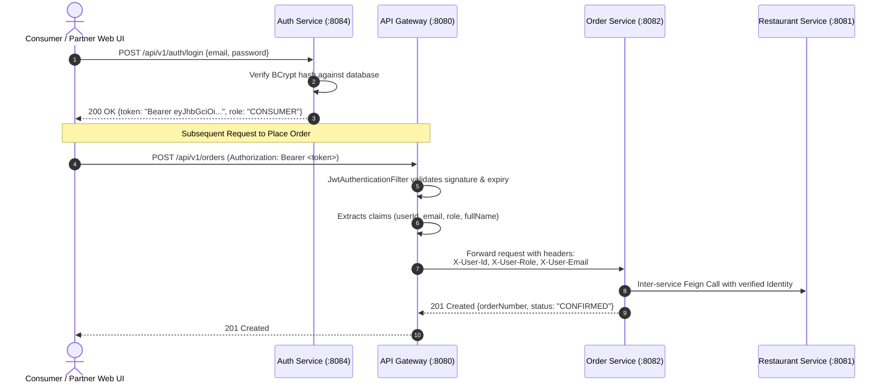

# JWT Authentication & Role-Based Security Specification
**Course**: 24SDCS03A - SOA PROGRAMMING AND MICROSERVICES  
**Project**: PS034 Multi-Restaurant Food Ordering & Delivery Orchestration Engine  
**Team**: PS34-S-03-02 (Om Prakhar, Mradul Dixit, Abhinav Singh)  

---

## 1. Security Architecture Overview
CraveDash implements a stateless, token-based authentication mechanism using **JSON Web Tokens (JWT)** signed via **HMAC-SHA256**. Security enforcement is centralized at the **API Gateway**, eliminating the need for each individual downstream microservice to manage session states or repetitively re-authenticate users against the database.



---

## 2. JWT Token Payload Structure
The token contains standard registered claims along with custom CraveDash claims:

### Header
```json
{
  "alg": "HS256",
  "typ": "JWT"
}
```

### Claims Payload
```json
{
  "sub": "om@cravedash.com",
  "userId": 1,
  "fullName": "Om Prakhar (Team Lead)",
  "role": "CONSUMER",
  "email": "om@cravedash.com",
  "iat": 1726999200,
  "exp": 1727085600
}
```

### Signature
```
HMACSHA256(
  base64UrlEncode(header) + "." +
  base64UrlEncode(payload),
  404E635266556A586E3272357538782F413F4428472B4B6250645367566B5970
)
```

---

## 3. Role-Based Access Control (RBAC) Matrix
| Endpoint / Resource | HTTP Method | Permitted Roles | Policy Enforcement |
| :--- | :--- | :--- | :--- |
| `/api/v1/auth/**` | POST, GET | Anonymous (Public) | Whitelisted in Gateway & SecurityConfig |
| `/api/v1/restaurants` | GET | Anonymous / All Roles | Public catalog browsing allowed |
| `/api/v1/restaurants/{id}/menu` | GET | Anonymous / All Roles | Public menu exploration |
| `/api/v1/restaurants/{id}/items/{itemId}/availability` | PUT | `RESTAURANT_OWNER`, `ADMIN` | Gateway verifies Bearer token & owner claim |
| `/api/v1/orders` | POST | `CONSUMER`, `ADMIN` | Gateway verifies authenticated consumer |
| `/api/v1/orders/{id}/tracking` | GET | `CONSUMER`, `DELIVERY_PARTNER`, `ADMIN` | Allows order progress inspection |
| `/api/v1/orders/{id}/status` | PUT | `RESTAURANT_OWNER`, `DELIVERY_PARTNER`, `ADMIN` | Step transition restricted to partners |

---

## 4. Password Security
Passwords are never stored in plaintext. The `AuthService` leverages Spring Security's `BCryptPasswordEncoder` with a work factor of 10:
```java
@Bean
public PasswordEncoder passwordEncoder() {
    return new BCryptPasswordEncoder();
}
```
Demo accounts are pre-seeded in `DataInitializer.java` using BCrypt salted hashes.
